# Interview Test Project

This project was assigned as part of the interviewing process for a frontend web developer position.

[LIVE URL](https://bmilcs.com/interview-test-project)

## Time Tracking

- Friday: 1 hour
- Saturday: 6.5 hours
- Sunday: 3.25 hours
- **Total**: 10.75 hours

## Instructions

The instructions were to create a fully responsive web page using modern best practices and technology that is best suited to the task. I received a Figma design, assets, and instructions containing 3 example web sites with interactive elements that I was to replicate.

Due to the time constraints, I had to move quickly and chose the following technology:

- Vite.js
- React
- JavaScript
- CSS

## Results

My personal goal for this project was to produce the best possible product in a short time span. I was able to complete ~95% of the requirements.

Here are some tangible metrics:

> Lighthouse Score

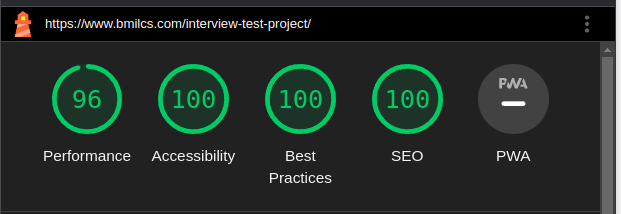

> Axe Devtools Accessibility

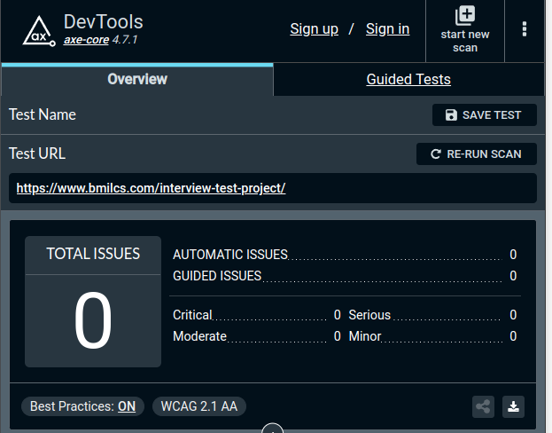

## Areas for improvement

If time wasn't of the essence, I would have done the following:

- Used an animation library, such as Framer Motion, to achieve a more polished UI/UX (all animations/transitions were done with vanilla CSS)
- Reduced polyfilled JavaScript sent to the client
- Created `<picture>` & `srcsets` with images of different resolutions to reduce network activity
- Deployed a CDN for assets
- Added responsive typefaces
- Improved accessibility

## Screenshots

> Desktop 1

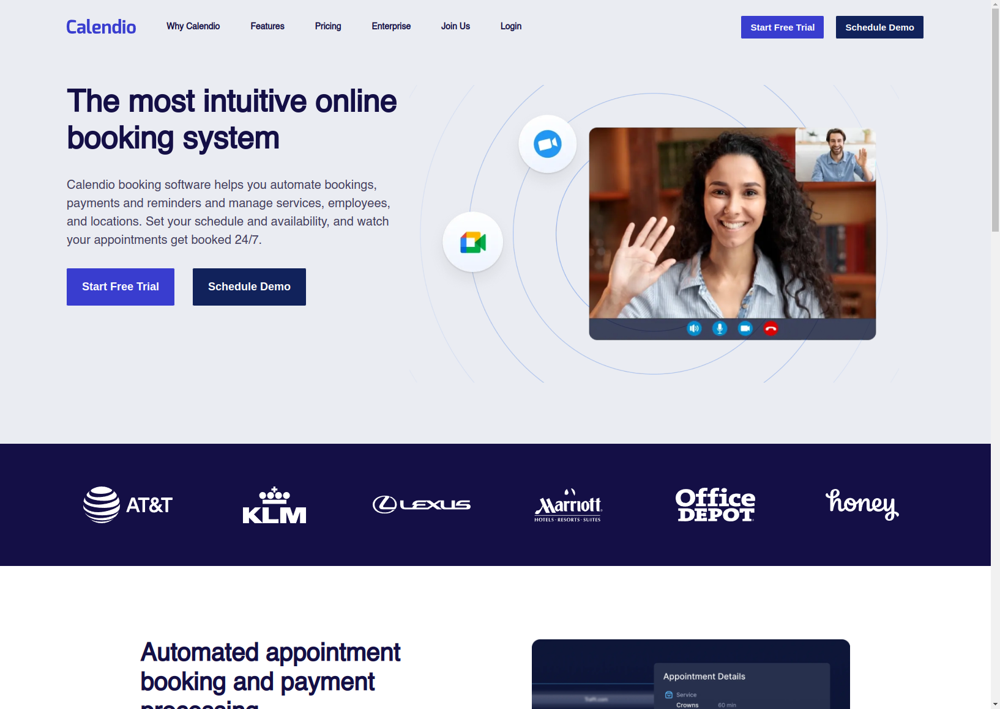

> Desktop 2

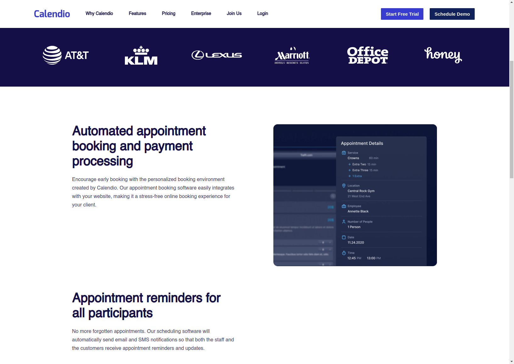

> Desktop 3

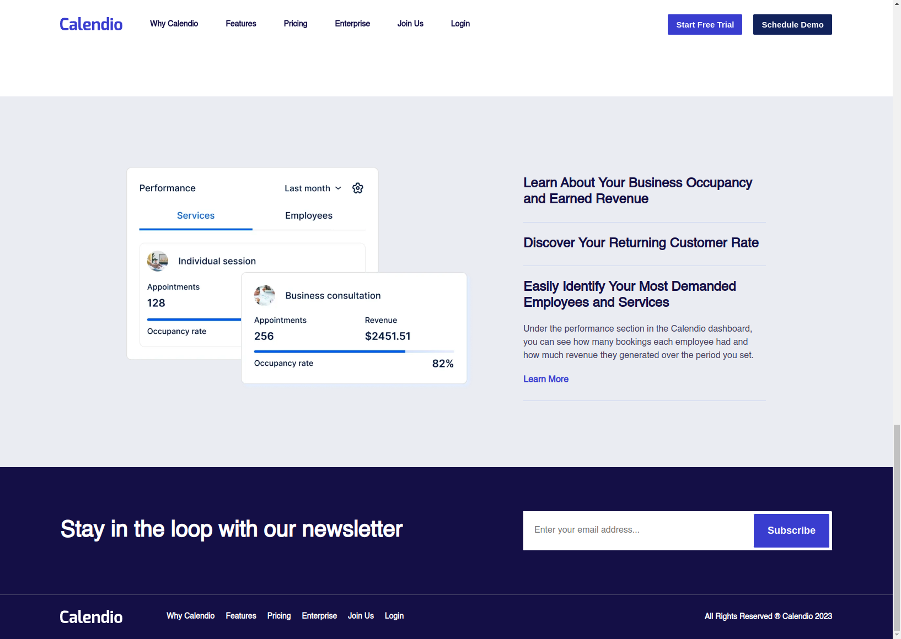

> Tablet 1

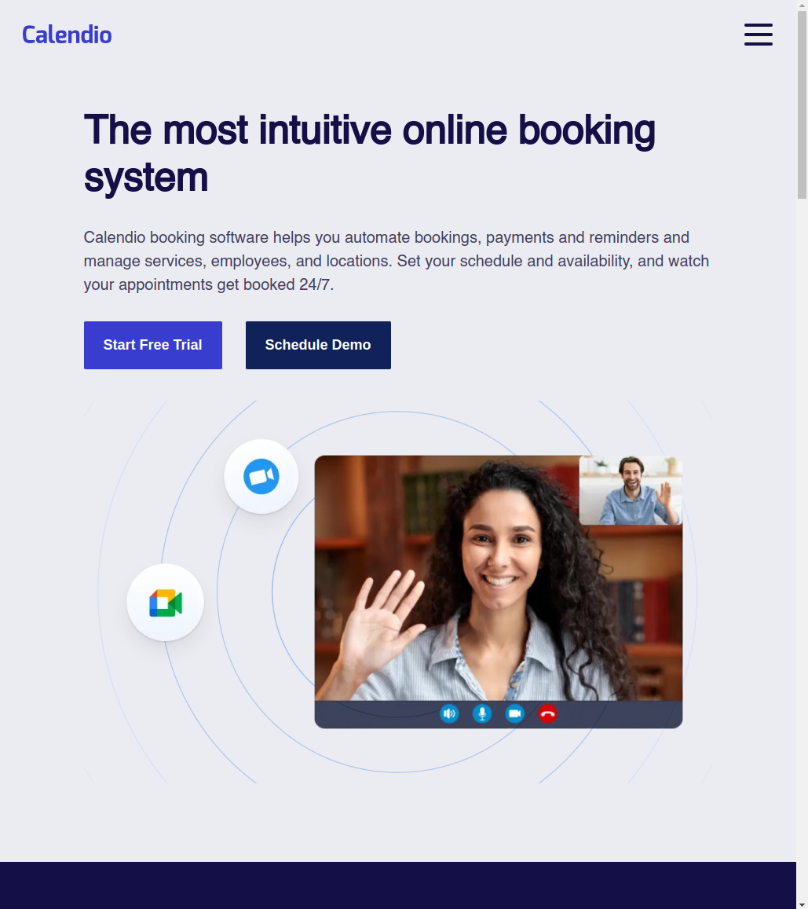

> Tablet 2

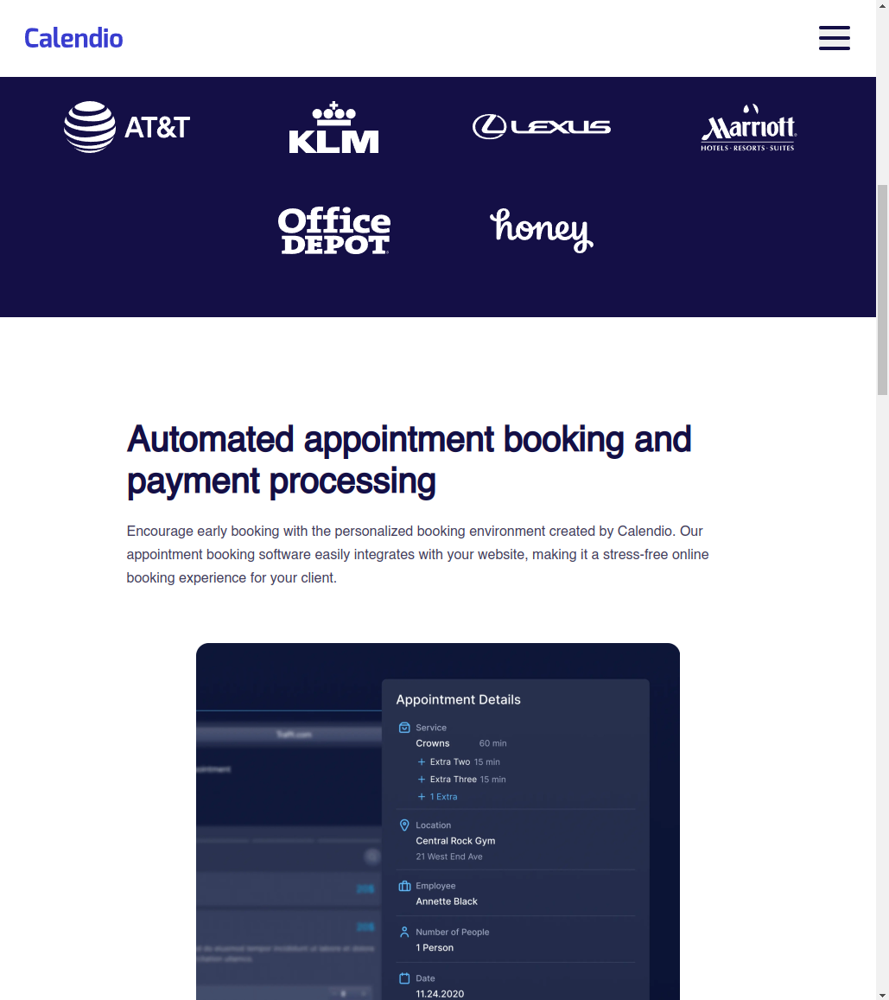

> Tablet 3

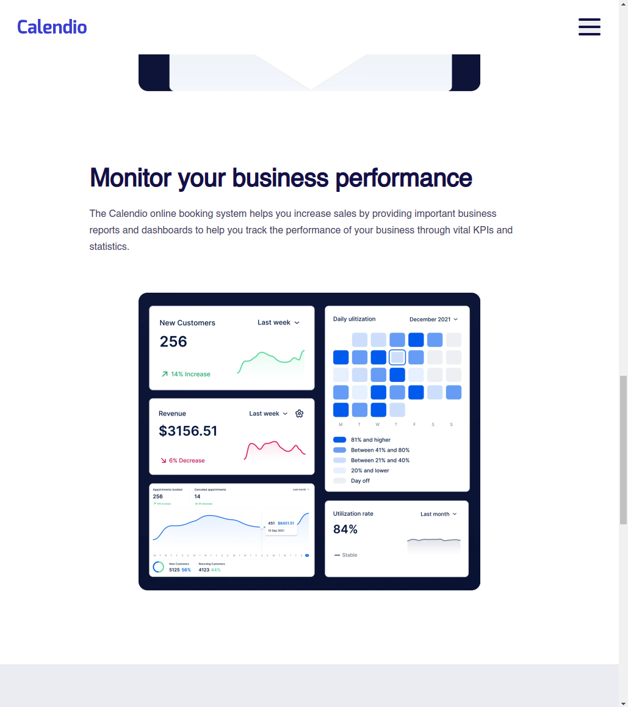

> Tablet 4

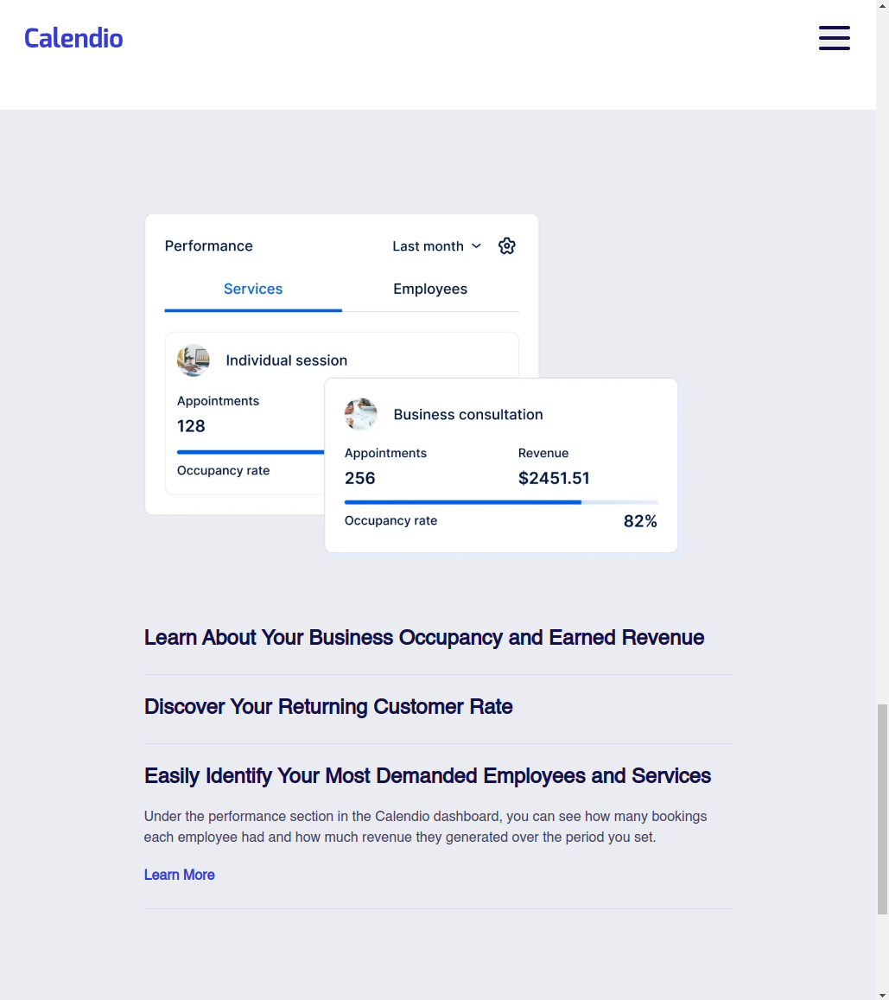

> Tablet 5

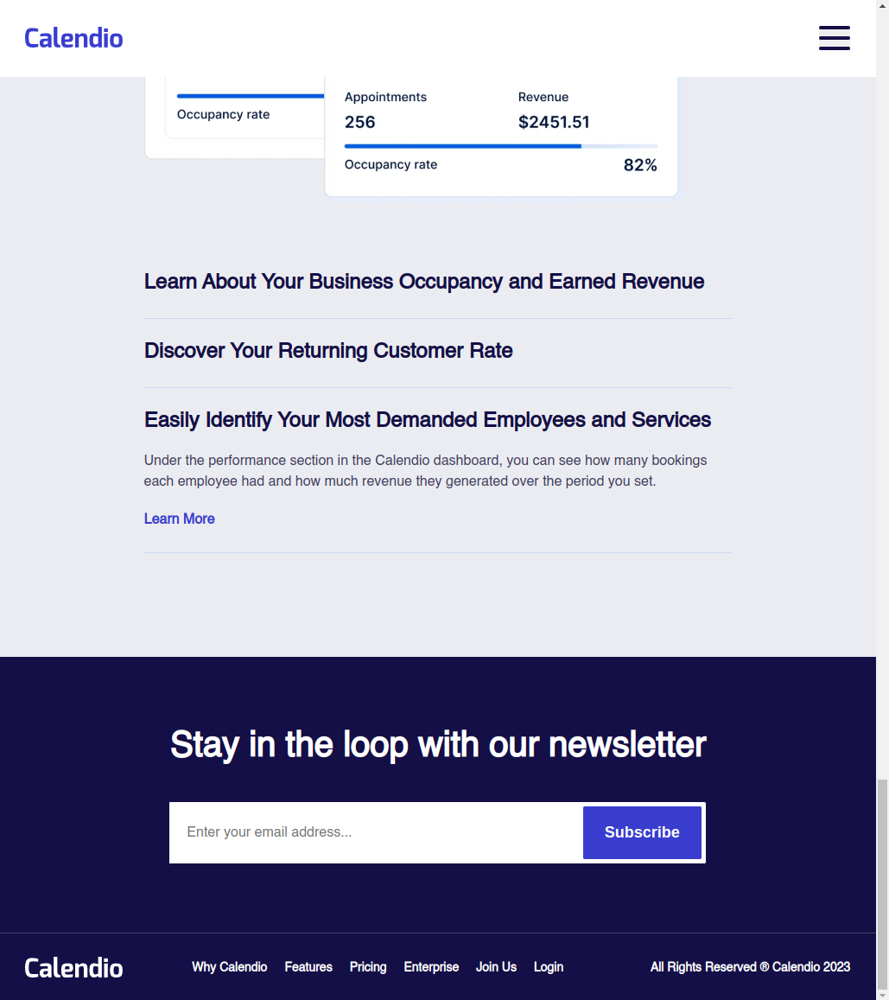

> Mobile Screenshots

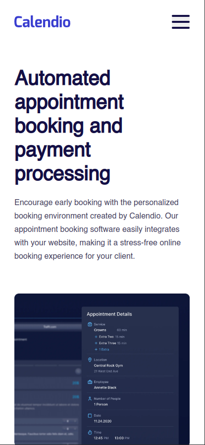
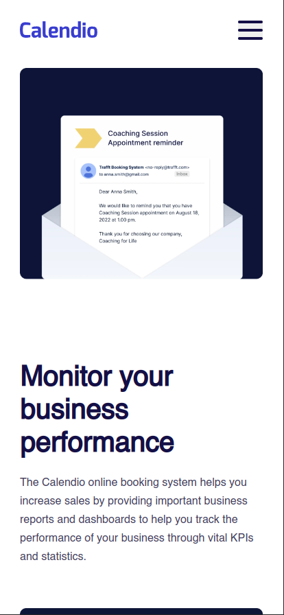
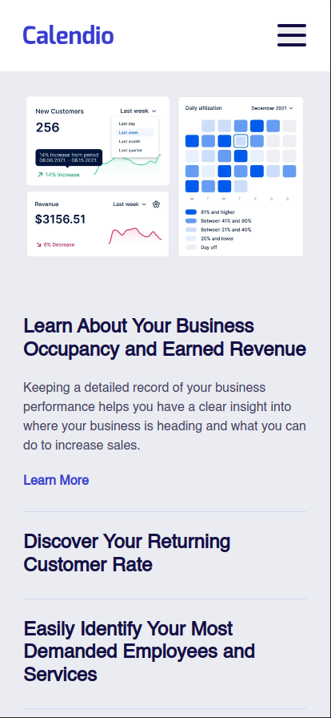
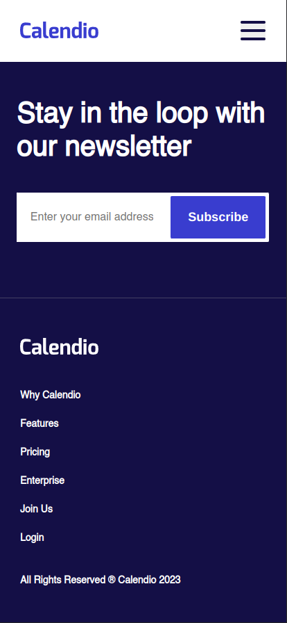
